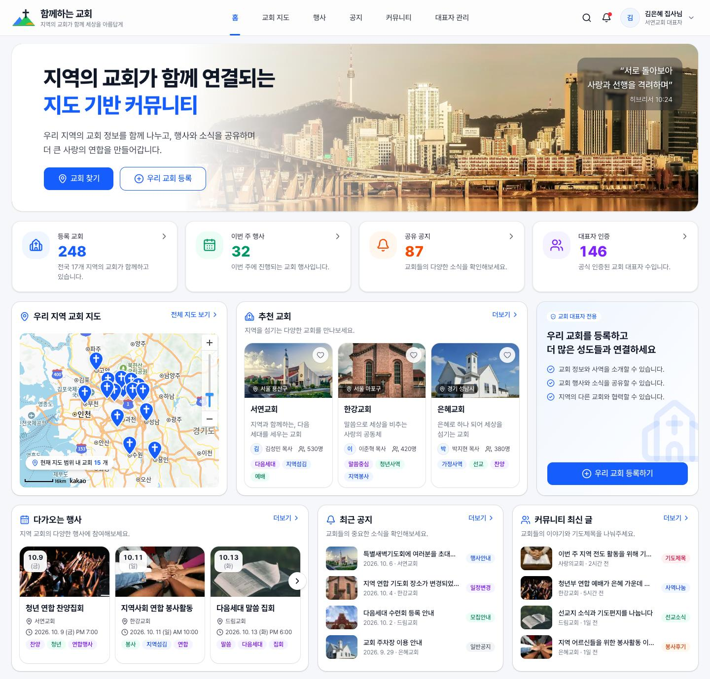
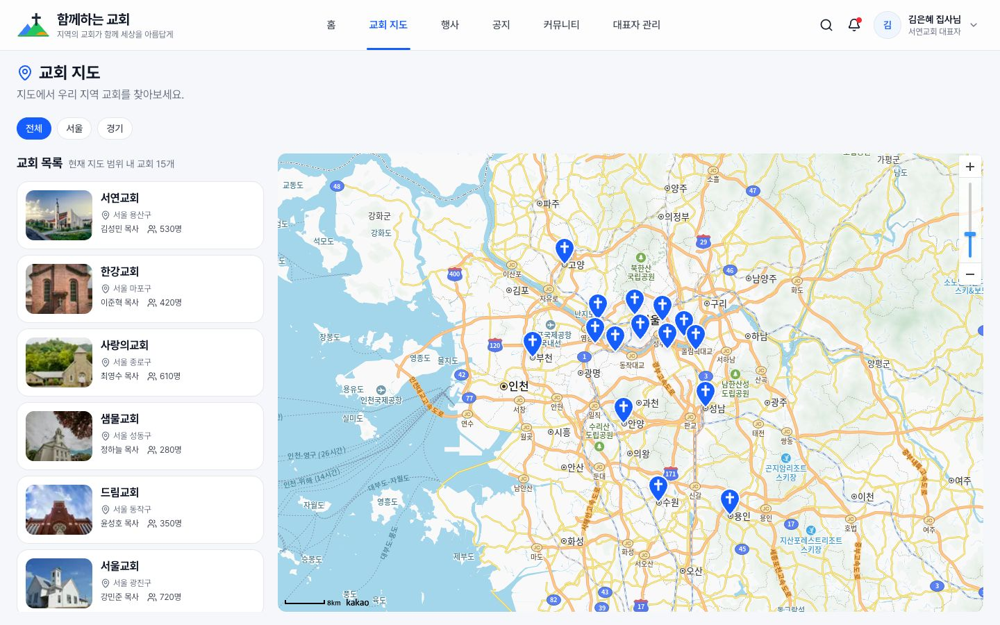
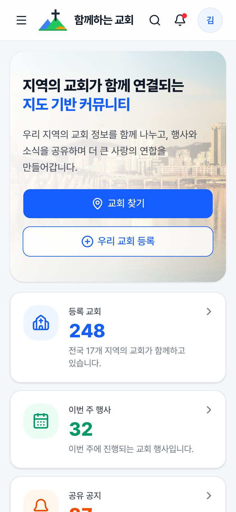
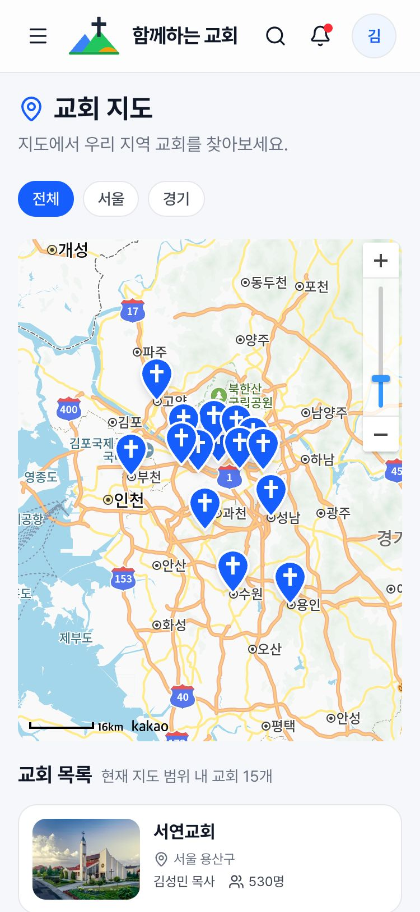
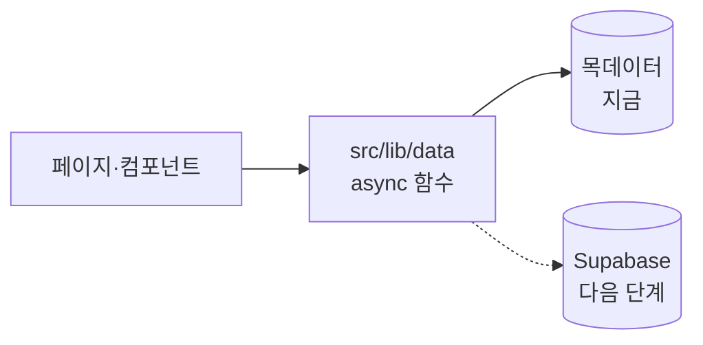

# 함께하는 교회

여러 지역 교회를 지도 위에서 연결하는 교회 연합 커뮤니티 웹입니다. 지도에서 교회를 찾고, 교회들의 행사·공지·나눔 글을 한곳에서 봅니다.

[](https://github.com/JungYOsup/church/actions/workflows/ci.yml?query=branch%3Amaster)

**운영 사이트: https://church-community-eight.vercel.app**

> 지금은 목데이터로 동작하는 UI 데모입니다. 로그인, 글쓰기, 교회 등록 저장은 다음 단계(Supabase)에서 붙입니다.

## 스크린샷





| 홈 (모바일) | 교회 지도 (모바일) |
| --- | --- |
|  |  |

## 주요 기능

- **홈:** 히어로, 통계 카드, 지역 교회 지도, 추천 교회, 다가오는 행사·최근 공지·커뮤니티 최신 글
- **교회 지도 (`/map`):** 카카오맵 위에 교회 15곳의 핀을 꽂습니다. 지도를 움직이면 범위 안의 교회만 목록에 남고, 핀이나 목록에서 고르면 사진 카드가 뜹니다. 서울·경기 지역 칩으로 거릅니다.
- **교회 상세 (`/churches/[id]`):** 소개, 교회 정보, 위치 지도, 그 교회의 다가오는 행사와 공지
- **행사·공지·커뮤니티 (`/events`, `/notices`, `/community`):** 태그나 분류 칩으로 거릅니다. 거른 상태가 주소(`?tag=`, `?category=`)에 남아 그대로 공유할 수 있습니다.
- **대표자 관리 (`/admin`):** 내 교회 대시보드와 교회 등록·인증 신청 폼(입력 검사 뒤 데모 접수)
- **통합 검색 (`/search?q=`)과 알림:** 교회·행사·공지·글을 한 번에 찾고, 헤더 알림에서 관련 화면으로 갑니다.
- 375px부터 1440px까지 반응형입니다. 카카오맵 키가 없거나 SDK를 불러오지 못하면 지도 자리에 대체 화면을 보여 줍니다.

## 기술 스택

| 영역 | 사용 |
| --- | --- |
| 프레임워크 | Next.js 16 (App Router), React 19, TypeScript |
| UI | Tailwind CSS v4, shadcn/ui, lucide-react, Pretendard |
| 지도 | 카카오맵 JavaScript SDK (래퍼 라이브러리 없이 자체 로더) |
| 테스트 | Vitest (단위), Playwright (동작), husky (커밋 전 검사) |
| 배포·CI | Vercel (함수 지역 서울), GitHub Actions |
| 다음 단계 | Supabase (DB, 인증, 스토리지, RLS) |

## 구조

```
src/app/          라우트: 홈, map, churches/[id], events, notices, community, admin, search
src/components/   화면 조각: layout, home, church, event, notice, post, map, common, ui(shadcn)
src/lib/          순수 로직(지도 범위, 서울 시각 표기, 검색 등)과 짝 테스트, 도메인 타입
src/lib/data/     데이터 접근 함수. 컴포넌트가 데이터를 얻는 유일한 통로
src/lib/mock/     목데이터: 교회 15곳, 행사 10개, 공지 8개, 글 8개, 알림 5개
e2e/              Playwright 동작 테스트와 가짜 카카오 SDK
docs/plans/       작업마다 남긴 계획서와 결정 기록
```



컴포넌트는 `src/lib/data`의 함수로만 데이터를 받습니다. 백엔드를 붙일 때는 이 함수들의 안쪽만 Supabase 쿼리로 바꾸고, 화면 코드는 그대로 둡니다.

## 시작하기

Node 22가 필요합니다(`.nvmrc`).

```bash
nvm use
npm install
cp .env.example .env.local   # 카카오맵 JavaScript 키를 넣는다(선택). 없으면 지도 자리에 대체 화면
npm run dev                  # http://localhost:3000
```

지도를 띄우려면 카카오 개발자 콘솔에서 JavaScript 키의 SDK 도메인에 `http://localhost:3000`을 등록합니다.

## 테스트

```bash
npm run test:unit   # Vitest 단위 테스트 (서버와 같은 UTC에서 실행)
npm run test        # 단위 테스트 → 빌드 → Playwright 동작 테스트
npm run lint
```

- 동작 테스트는 실제 카카오 서버 없이 가짜 SDK로 돕니다.
- 커밋할 때 husky가 lint와 전체 테스트를 돌리고, push와 PR마다 GitHub Actions가 같은 검사를 돌립니다.

## 개발 방식

Claude Code와 함께 만들면서, AI가 일하는 방식을 저장소의 규칙과 자동 검사(하네스)로 정해 두었습니다.

- 요청마다 영향 범위를 찾아 규모를 판정합니다(`spec-check`). 큰 작업은 계획서를 승인받은 뒤, 확인할 수 있는 task로 나눠 하나씩 진행합니다(`plan-work`, `run-plan`). 계획서는 [docs/plans](docs/plans)에 있습니다.
- 테스트를 먼저 씁니다. `src/lib`의 로직 파일은 짝 테스트 없이 쓰려 하면 hook이 막습니다.
- 응답이 끝날 때는 단위 테스트·lint·빌드가, 커밋할 때는 전체 테스트가 자동으로 돌고, 실패하면 넘어가지 못합니다.
- 작업 중 걸려 넘어진 함정과 해결법은 [docs/lessons.md](docs/lessons.md)에 모읍니다.

규칙은 [CLAUDE.md](CLAUDE.md)에, 스킬과 hook은 [.claude](.claude)에 있습니다.

## 로드맵

- [x] 1단계 UI: 모든 화면을 목데이터로
- [x] Vercel 배포와 CI
- [ ] 2단계 백엔드: Supabase DB·인증(카카오·이메일)·RLS, 교회 등록과 글쓰기
- [ ] README에 ERD와 RLS 설계 더하기

## 사진 출처

히어로 배경과 교회·행사 사진은 Unsplash License 사진입니다. 촬영자와 원본 링크는 [구현 계획의 변경 이력](docs/plans/2026-09-30-church-community.md#변경-이력)에 있습니다. 교회 사진은 그 교회의 실제 모습이 아닙니다.
